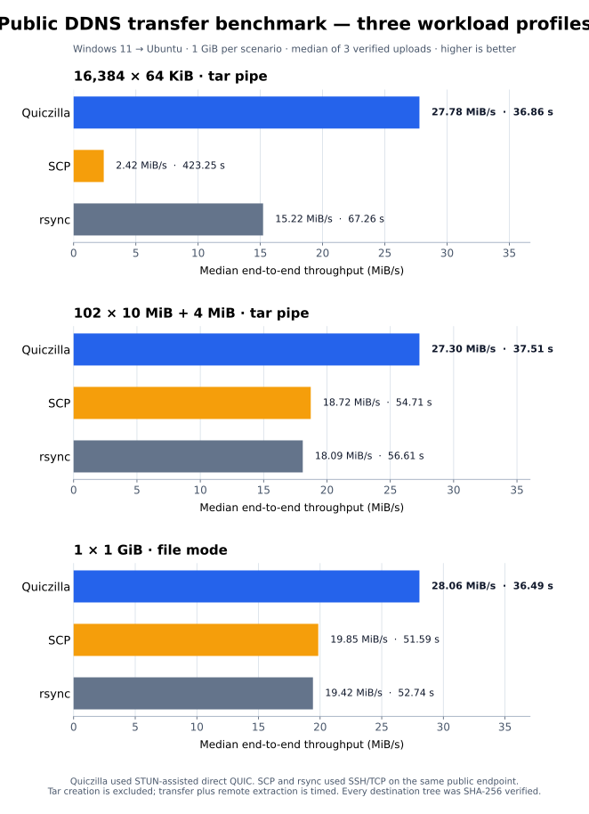

# Quiczilla

> **High-Throughput Encrypted P2P File Transfers Over QUIC and mTLS**

Quiczilla is a cross-platform peer-to-peer direct file transfer system combining the simplicity and universal accessibility of **SSH** with the massive throughput and multiplexing of **QUIC (RFC 9000)** and **mTLS** encryption.

* **Phase 1 (CLI):** Feature-comparable with `scp` over SSH, but powered by direct UDP/QUIC data streams with a zero-install, cached remote worker.
* **Phase 2 (GUI):** A new FileZilla-style desktop client will be built on the completed CLI transport, with remote browsing, transfer queues, and resumption.

---

## Quick Install

### Linux (Bash)
```bash
curl -fsSL https://raw.githubusercontent.com/cmdPromptCritical/quiczilla/master/install.sh | bash
```

### Windows (PowerShell)
```powershell
irm https://raw.githubusercontent.com/cmdPromptCritical/quiczilla/master/install.ps1 | iex
```

### From Source (Cargo)
```bash
git clone https://github.com/cmdPromptCritical/quiczilla.git
cd quiczilla
# Linux source builds need the native MsQuic runtime. Official release
# archives already include it.
sudo apt update
sudo apt install -y libmsquic
cargo build --release
# Binary available at target/release/quiczilla-cli (or install.ps1 / ./install.sh)
```

On Ubuntu/Debian systems where `libmsquic` is not yet available, add
[Microsoft's package repository](https://packages.microsoft.com/config/ubuntu/)
for your distribution first, then install the package above. The runtime must
be discoverable as `libmsquic.so`/`libmsquic.so.2`, or copied beside the CLI.
When present, the Linux source build embeds that same runtime for zero-install
remote-worker bootstrap as well.
Windows source builds use the installed `msquic.dll` from the .NET runtime.

`cargo build --release` also builds the local-platform worker. A source-built
CLI prefers that fresh sibling worker for a same-platform remote host; for a
cross-platform target, use the official release archive so it has the matching
CI-built worker for that target.

To build every active binary, including the remote worker:

```bash
cargo build --release
```

When run from a checkout, the installers use a release binary already present at `target/release/`; otherwise they download the matching self-contained release artifact. Each official archive includes the CLI, the pre-installed worker, and its matching MsQuic runtime; Rust, Cargo, .NET, and a system MsQuic package are not required.

Direct downloads always resolve to the newest published release:

* Windows x64: `https://github.com/cmdPromptCritical/quiczilla/releases/latest/download/quiczilla-windows-x86_64.zip`
* Linux x64: `https://github.com/cmdPromptCritical/quiczilla/releases/latest/download/quiczilla-linux-x86_64.tar.gz`

For a private GitHub repository, set `QUICZILLA_GITHUB_TOKEN` to a token that can read repository contents and releases
before running the installer. Public repositories need no token.

For a private repository, authenticate the script fetch as well:

```powershell
$env:QUICZILLA_GITHUB_TOKEN = "<github-token>"
$h = @{ Authorization = "Bearer $env:QUICZILLA_GITHUB_TOKEN" }
Invoke-RestMethod https://raw.githubusercontent.com/cmdPromptCritical/quiczilla/master/install.ps1 -Headers $h | Invoke-Expression
```

```bash
export QUICZILLA_GITHUB_TOKEN='<github-token>'
curl -fsSL -H "Authorization: Bearer $QUICZILLA_GITHUB_TOKEN" \
  https://raw.githubusercontent.com/cmdPromptCritical/quiczilla/master/install.sh | bash
```

### Publishing a release

Push a version tag to produce a GitHub Release, both x64 archives, and `SHA256SUMS`:

```bash
git tag v0.1.1
git push origin v0.1.1
```

The release workflow builds each worker on its native OS, embeds both worker targets and their native MsQuic runtimes into each CLI, then packages the matching local runtime beside the installed binaries. Linux artifacts are built on Ubuntu 22.04 using Microsoft’s supported `libmsquic` package and target modern glibc x64 distributions.

For operating Quiczilla's optional public default STUN service, see
[deploy/STUN.md](deploy/STUN.md). The service performs candidate discovery only;
file data remains direct QUIC or SSH fallback.

### Benchmarking against SCP, rsync, and qcp

The repeatable PowerShell harness compares release-mode Quiczilla, `scp`,
`rsync`, and optionally [qcp](https://github.com/crazyscot/qcp) against the
same Linux receiver. It records wall-clock time and Quiczilla's payload time,
reports the selected transport, and verifies every destination with SHA-256.
`qcp` must be installed and available on both endpoints: it starts its remote
server through SSH, but it needs a directly reachable UDP port range and does
not use Quiczilla's STUN broker.

```powershell
.\benchmarks\benchmark_transfer.ps1 `
  -SourcePath .\test_1gb.bin `
  -SshTarget ops@receiver.example.net `
  -RemoteDir /srv/quiczilla-benchmark `
  -SshPort 2222 `
  -QuicPath .\target\release\quiczilla-cli.exe `
  -StunServer stun.example.net:3478 `
  -RequireDirectQuic
```

Add `-UsePipe` for stream/pipe-mode measurements. This is useful for small,
unseekable, or generated payloads; omit it for normal file-transfer mode.
On Windows, some rsync distributions bundle a Cygwin SSH client that must be
used instead of Windows OpenSSH. Supply it explicitly with
`-RsyncSshCommand '<path-to-bundled-ssh> -p <port> -o UserKnownHostsFile=<known-hosts-path>'`
so the benchmark retains host-key verification.

The script intentionally retains uniquely named remote benchmark artifacts so
results can be inspected; remove them after recording a result. Compare medians
from at least three runs and do not treat SSH-fallback measurements as direct
QUIC performance. Add `-SkipRsync` or `-SkipQcp` only when the respective tool
is unavailable. Add `-RequireDirectQuic` to fail immediately if Quiczilla falls
back to SSH. Add `-StunServer host:port` to force the Quiczilla leg through the
configured STUN-assisted path.

For a workload composed of many files, use the companion batched-tree harness.
It puts the directory into one uncompressed tar stream for `quic pipe`, while
SCP and rsync recursively copy the identical tree. Archive creation is outside
the timed interval; transfer and remote extraction are timed, and a deterministic
per-file SHA-256 manifest check gates every result. This makes the file-count
cost visible. For the native streamed directory protocol, use
`quic <directory> target` (or `quic send <directory> target`); that mode is
bounded and does not create a temporary archive.

```powershell
.\benchmarks\benchmark_batched_tree.ps1 `
  -SourceDirectory .\fixture-tree `
  -SshTarget ops@receiver.example.net `
  -RemoteDir /srv/quiczilla-benchmark `
  -SshPort 2222 `
  -QuicPath .\target\release\quiczilla-cli.exe `
  -StunServer stun.example.net:3478
```

### Measured benchmark: Windows 11 to Ubuntu over public STUN

The following is a reproducible point-in-time measurement of the installed
GitHub `v0.1.11` release. Each scenario sends exactly 1 GiB of non-compressible
data from a Windows 11 client to an Ubuntu receiver, and each value is the
median of three runs. For the first two rows, `quic pipe` streams an uncompressed
tar archive; SCP and rsync recursively copy the same source tree. Tar creation
is excluded from timing, but transfer and remote extraction are timed; every
completed destination-tree SHA-256 manifest check gates its result. The last
row uses normal
single-file `quic` mode. Quiczilla was required to use `stun-quic`; SCP and
rsync used the receiver's public SSH/TCP endpoint.

| 1 GiB workload | Quiczilla (STUN QUIC) | SCP baseline | Relative result | rsync | qcp |
| :--- | ---: | ---: | :--- | :--- | :--- |
| 16,384 × 64 KiB, tar pipe | **27.78 MiB/s (36.86 s)** | 2.42 MiB/s (423.25 s) | Quiczilla 11.5× SCP | 15.22 MiB/s (67.26 s) | Not installed on either endpoint |
| 102 × 10 MiB + 4 MiB, tar pipe | **27.30 MiB/s (37.51 s)** | 18.72 MiB/s (54.71 s) | Quiczilla +46% SCP | 18.09 MiB/s (56.61 s) | Not installed on either endpoint |
| 1 × 1 GiB, file mode | **28.06 MiB/s (36.49 s)** | 19.85 MiB/s (51.59 s) | Quiczilla +41% SCP | 19.42 MiB/s (52.74 s) | Not installed on either endpoint |



The chart is generated by
[`benchmarks/plot_transfer_performance.py`](benchmarks/plot_transfer_performance.py).
Each panel has its own throughput scale so the small-payload comparison remains
readable; the adjacent labels provide both median throughput and elapsed time.

This is intentionally not presented as a protocol-only comparison: Quiczilla
uses STUN only to discover candidates, then carries data directly over UDP/QUIC;
SCP and rsync use SSH/TCP. The tar-pipe cases show the advantage of deliberately
batching many files into one data stream, while the single-file case exposes
steady-state file-transfer throughput. The public path, host, payload generator,
and run order can affect results. `qcp` also uses QUIC, but it needs its
executable on both machines and an inbound, directly reachable UDP port/range
on the receiver; it cannot use Quiczilla's STUN broker. Install those tools and
repeat the harness before making a three- or four-way claim.

Pipe mode now sends a clean QUIC stream FIN after stdin EOF and supports the
same STUN options as file transfer. The pipe rows above were run after the
installed v0.1.11 client refreshed the matching CI-built Linux worker.

### v0.1.12 single-file rerun

After publishing `v0.1.12`, the same 1 GiB single-file workload was repeated
from the GitHub Windows archive against the same public Ubuntu endpoint. Each
tool ran three times, every destination passed SHA-256 verification, and
Quiczilla was forced to `stun-quic`:

| Tool | Median throughput | Runs (MiB/s) |
| :--- | ---: | :--- |
| **Quiczilla v0.1.12** | **27.86 MiB/s** | 28.56, 27.49, 27.86 |
| SCP | 14.05 MiB/s | 14.85, 14.05, 12.01 |

Quiczilla was approximately 98% faster than SCP for this run. Rsync was not
included in this rerun because the Windows rsync installation failed with
protocol error 12 even for a small diagnostic file; this is an endpoint
tooling issue, so no rsync result is claimed here. The raw result file was
retained locally as `scratch/benchmark-v0.1.12-1gb-quic-scp.json`.

---

## How It Works (SSH Bootstrap + QUIC Tunnel)

Traditional `scp` and `sftp` suffer from single-TCP stream bottlenecks, head-of-line blocking, and high latency over lossy or cross-region connections. Traditional P2P tools require persistent background daemons (`sshd`-like services) or third-party cloud signaling servers.

Quiczilla takes a **hybrid zero-install approach**:

```
[Local Machine (Windows / Linux)]
    │
    │  1. SSH Handshake: Probe OS & Check SHA-256 Cache
    │  2. If cache miss: Stream embedded lightweight static worker
    │  3. Remote executes worker: echoes UDP port & ephemeral thumbprint
    │
    ├─── Control Plane (SSH Standard I/O)
    │       ├── Target probe (`uname -sm` / Windows arch)
    │       └── Ephemeral mTLS thumbprint exchange
    │
    └─── Data Plane (Direct UDP / QUIC Tunnel)
            ├── High-throughput UDP file chunking (2 MiB chunks)
            ├── Strict mTLS handshake verification
            └── Real-time SHA-256 verification & auto parent dir creation
```

1. **Ephemeral mTLS:** Local CLI generates a one-time self-signed certificate and calculates its thumbprint.
2. **OS Probe & Userspace Cache:** Checks `~/.cache/quiczilla/` (Linux) or `%LOCALAPPDATA%\quiczilla\` (Windows).
   * **Cache Hit:** If the worker binary with matching SHA-256 is already cached, it launches immediately (<0.85s bootstrap).
   * **Cache Miss:** Automatically pipes the compressed embedded worker binary over SSH stdin and sets executable permissions.
3. **Direct QUIC Tunnel:** The remote worker binds to a dynamic UDP port and prints its port and thumbprint. The local CLI dials the remote IP over UDP, completes the mTLS handshake, and blasts file streams at wire speed.

---

## CLI Usage

> **Note:** The CLI is available interchangeably as both `quic` and `quiczilla`. Both commands are registered by the installers.

### 1. Direct File and Directory Transfer
Transfer local files or a complete directory tree to a remote destination with
automatic SSH bootstrap, userspace binary caching, and direct QUIC streaming:

```bash
quic <local_file-or-directory> <user@host:destination_folder/> [-c|--resume] [--checksum] [-i|--identity <key>]
    [-q|--quiet|--no-progress|--verbose|--json] [-p|--port <ssh-port>]
    [--transport auto|direct|stun|manual|ssh] [--stun-server <host:port>]
    [--quic-host <host-or-ip>] [--quic-port <port>]

# Examples:
quic dataset.tar.gz ops@receiver.example.net:/srv/incoming/
quic -c -i ~/.ssh/id_ed25519 large_disk.iso admin@192.0.2.50:C:\Transfers\

# Directory trees are detected automatically; `send` is an optional explicit spelling.
quic send ./project ops@receiver.example.net:/srv/incoming/ --checksum
```

The default terminal display updates every 500 ms with the file name, a progress bar, transferred bytes, rate, and ETA. Progress is written to standard error so standard output remains available to callers.

For automation and benchmarking, add `--json`. On successful file transfers it
emits one JSON receipt on standard output containing the selected transport,
payload duration, byte count, throughput, and integrity result. Human progress
and diagnostics remain on standard error. Structured failure exit codes are
planned as a follow-up to the transfer lifecycle refactor.

* **Hot Pause / Resume:** Press <kbd>Space</kbd> or <kbd>p</kbd> at any time during an active transfer to instantly pause transmission without closing the connection. Press <kbd>Space</kbd> or <kbd>p</kbd> again to resume. Press <kbd>q</kbd> or <kbd>Ctrl+C</kbd> to cancel.
* **Cold Resumption (`-c`, `--resume`):** Interrupted transfers can be resumed at any time by specifying `-c` or `--resume`. For files ≥ 20 MiB, transfers stage in `<file>.quic-part` aligned to 2 MiB boundaries with a rapid 64 KiB prefix fingerprint check. If the local file changes, Quiczilla automatically falls back to restarting from byte 0.

#### Native directory mode

Directories are streamed through one mTLS-authenticated QUIC connection. The
sender traverses incrementally and groups small files into logical packs; it
does **not** construct a temporary tar/zip archive, pre-scan the entire tree,
or retain the tree in memory. Each file is read and written using the bounded
2 MiB transfer buffer. Empty directories are preserved; source symlinks are
skipped, and destination symlinks/path traversal are refused.

Choose a storage profile only when the automatic balanced profile is not right
for the endpoint pair:

```bash
# Sequential 16 MiB logical packs: safest for either endpoint on an HDD.
quic ./photos ops@receiver.example.net:/srv/incoming/ --storage-profile hdd

# Balanced 32 MiB packs (default).
quic ./project ops@receiver.example.net:/srv/incoming/

# 64 MiB logical packs for known NVMe/SSD endpoints on a fast path.
quic ./build-output ops@receiver.example.net:/srv/incoming/ --storage-profile nvme
```

A pack target controls accounting and file grouping, not a RAM allocation: no
pack is buffered or staged as a file. The first directory release uses one
in-flight pack to keep HDD access sequential; `--resume` and SSH fallback are
currently file-mode features and are rejected for directory jobs rather than
silently changing semantics.

### Connection selection

`--transport auto` is the default. It gives the SSH hostname, LAN, VPN, or mesh
candidate a 150 ms head start, then races the STUN-reflexive public candidate
when a STUN service is configured. The first mTLS-authenticated QUIC connection
wins; STUN never carries file data. If neither UDP candidate works, auto mode
falls back to SSH streaming.

Set `QUICZILLA_STUN_SERVER=stun.example.net:3478` for a per-user default, or
set the GitHub repository variable `QUICZILLA_DEFAULT_STUN_SERVER` before a
release to bake the official service into release binaries. Command-line
`--stun-server` takes precedence over both.

```bash
# STUN-assisted UDP, with SSH used only for bootstrap or fallback
quic archive.tar ops@receiver.example.net:/srv/incoming/ \
  -p 2222 --stun-server stun.example.net:3478

# Prefer an explicitly routed LAN, VPN, mesh, or known public address while
# retaining SSH only for authenticated bootstrap.
quic archive.tar ops@receiver.example.net:/srv/incoming/ \
  -p 2222 --transport direct --quic-host 192.0.2.44

# A fixed port you have forwarded as UDP on the remote router
quic archive.tar ops@receiver.example.net:/srv/incoming/ \
  -p 2222 --transport manual --quic-host 203.0.113.10 --quic-port 55441

# Force SSH streaming when only the SSH port is intentionally exposed
quic archive.tar ops@receiver.example.net:/srv/incoming/ -p 2222 --transport ssh
```

### 2. Universal Raw Stream / Pipe Mode (`quic pipe`)
Transform Quiczilla into an encrypted, multiplexed UNIX pipe. Replaces `nc` over WireGuard for arbitrary streams, unseekable inputs, and live process pipelines:

```bash
# Push a ZFS snapshot across the WAN directly into remote zfs receive
zfs send pool/dataset@snap | quic pipe user@remote "zfs receive backup/dataset"

# Stream an on-the-fly tarball to a remote directory without temporary files
tar czf - /var/data | quic pipe user@remote "tar xzf - -C /backup"

# Pull a remote database dump or command output directly into local stdout
quic pipe user@remote "pg_dump production_db" > local_backup.sql

# Optional: Add --verify to compute and log end-to-end SHA-256 wire checksums
cat dump.bin | quic pipe user@remote "cat > /data/dump.bin" --verify
```

### 3. Persistent Daemon Mode (`quic daemon`)
For environments with persistent network meshes (WireGuard, Tailscale, LAN) or locked-down servers that prefer an always-on listener without per-transfer SSH negotiation:

```bash
# 1. On each client, create its persistent mTLS identity and copy its printed thumbprint.
quic identity
# 720A73366D921F1E7FEB13E3BB758AFA3E34753E

# 2. On the receiving host, authorize that client (one thumbprint per line;
# blank lines and comments are allowed), then start the receiver.
printf '%s\n' 720A73366D921F1E7FEB13E3BB758AFA3E34753E \
  | sudo tee /etc/quiczilla/authorized_thumbprints
quic daemon --port 55441 --allow-thumbprints /etc/quiczilla/authorized_thumbprints --save-dir /backup --on-conflict refuse
# {"status":"daemon_ready","udp_port":55441,"thumbprint":"A9D91656F38DB941CC35498552AE4FF9FA4F979B"}

# 3. On the authorized client, pin the daemon thumbprint printed at startup.
quic direct receiver.example:55441 archive.tar \
  --thumbprint A9D91656F38DB941CC35498552AE4FF9FA4F979B --checksum
```

The daemon requires a non-empty allow-list; it authenticates every client certificate against every listed thumbprint and saves only the local basename into `--save-dir`. Existing files are overwritten by default for compatibility; use `--on-conflict refuse` to reject a transfer when that basename already exists (resumes remain allowed when `--resume` is requested). `quic direct` requires the daemon thumbprint, so both sides are authenticated and pinned. Open or forward UDP (not TCP) for the selected daemon port when the hosts are not already on the same private mesh.

Identities are stable across restarts: Linux stores protected PEM material under `~/.config/quiczilla/{client,daemon}` (respecting `XDG_CONFIG_HOME`); Windows stores the private key in the current user's Windows certificate store and records its selected thumbprint under `%LOCALAPPDATA%\quiczilla`. `--identity-dir <dir>` makes that identity selection explicit for automation and testing. Use `quic daemon --help`, `quic direct --help`, or `quic identity --help` for the complete command-specific syntax. A thumbprint is a certificate identifier; TLS 1.3 and mTLS provide the actual cryptographic authentication.

### 4. Zero-Trust / NoExec Compliance
For early alpha releases, Quiczilla checks the SHA-256 of a detected installed
remote worker against the worker embedded in the client. A match runs the
installed worker directly. A mismatch refreshes the managed worker bundle in
`~/.cache/quiczilla/bundle-<sha256>/` (Linux) or
`%LOCALAPPDATA%\quiczilla\bundle-<sha256>\` (Windows), so a new client
automatically uses its matching worker/runtime pair. The content-addressed
directory never overwrites a worker that another transfer is still executing.
If that managed location cannot execute—for example, due to a `noexec`
policy—Quiczilla warns and uses the existing installed worker instead. Future
releases will add an explicit protocol-compatibility check to that fallback.
After a managed worker starts, Quiczilla best-effort prunes its remote cache to
the three newest content-addressed bundles (the active bundle plus two recent
ones). Cleanup failures are non-fatal, so locked Windows executables,
read-only caches, or administrator policies cannot interrupt a transfer.

---

## Workspace Architecture

The project is structured as a modular Cargo Workspace:

| Crate / Subdirectory | Purpose |
| :--- | :--- |
| [`core/`](core/) | Reusable `quiczilla-core` library: MsQuic transport, mTLS certificate setup, framing, and chunk streaming. |
| [`worker/`](worker/) | Lightweight `quiczilla-worker` binary: Remote receiver executed over SSH that dynamically binds UDP and receives files. |
| [`cli/`](cli/) | Main `quiczilla-cli` executable: Handles CLI arguments, SSH bootstrap pipeline, embedded binary matrix, and QUIC dialing. |

---

## Development & Verification

See [CONTRIBUTING.md](CONTRIBUTING.md) for contribution workflow, security
expectations, and the verification required before review.

### Prerequisites
* **Rust:** 1.85+ (Edition 2024)
* **OpenSSH:** Standard `ssh` client on your system PATH.

### Standard Commands

```bash
# Fast syntax and type checking
cargo check --workspace

# Run Rust unit tests across all workspace crates
cargo test --workspace --lib

# Build all release binaries
cargo build --release
```

---

## Roadmap

- [x] **Phase 1: Zero-Install SSH-Bootstrapped QUIC CLI**
  - [x] Cargo workspace modularization (`core`, `worker`, `cli`).
  - [x] Cross-platform SSH remote probe & userspace caching (`~/.cache/quiczilla` & `%LOCALAPPDATA%\quiczilla`).
  - [x] Embedded binary matrix (`include_bytes!`) for Linux x86_64 and Windows x86_64.
  - [x] Dynamic UDP port allocation and handshake verification.
  - [x] Path traversal protection (`Path::file_name()`) and automatic parent directory creation.
  - [x] Automated benchmark script and throughput logging.
  - [x] One-line installation scripts (`install.sh` and `install.ps1`).
- [ ] **Phase 2: FileZilla-Style Desktop GUI**
  - [ ] Establish a new desktop application shell and GUI architecture.
  - [ ] Remote directory tree browsing (`ls`, `stat`, `mkdir`) over SSH control channel.
  - [ ] Drag-and-drop transfer queue with concurrent QUIC streams.
  - [ ] Per-transfer stream isolation and clean transfer cancellation.
